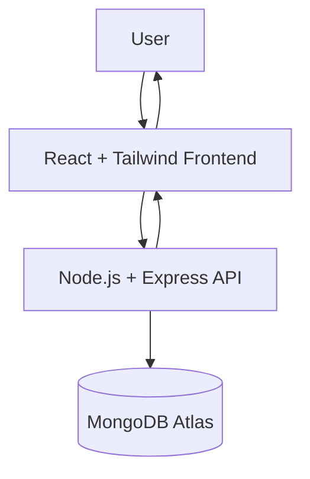

# 🚗 Car Booking Web Application


A modern and responsive **Car Booking Website UI** built using **React, Vite, and Tailwind CSS**.
The project demonstrates **clean UI design, reusable components, and scalable frontend architecture** for a vehicle rental platform.

---

# 🌐 Live Demo

🔗 https://car-booking-mauve.vercel.app

---

# ✨ Features

* Fully responsive design (Mobile, Tablet, Desktop)
* Modern **Hero Section with Call-to-Action**
* Car listing section
* Booking interface layout
* Modular and reusable components
* Clean and scalable folder structure
* Fast development using **Vite**

---

# 📌 Tech Stack

| Technology   | Purpose                          |
| ------------ | -------------------------------- |
| React        | Component-based UI development   |
| Vite         | Fast build tool                  |
| Tailwind CSS | Responsive utility-first styling |
| PostCSS      | CSS processing                   |
| JavaScript   | Application logic                |

---

# 🧠 API Endpoints (Future Backend Integration)

When backend integration is added, the system will expose the following endpoints:

## Authentication

| Method | Endpoint           | Description   |
| ------ | ------------------ | ------------- |
| POST   | /api/auth/register | Register user |
| POST   | /api/auth/login    | Login user    |

---

## Car Management

| Method | Endpoint      | Description         |
| ------ | ------------- | ------------------- |
| GET    | /api/cars     | Get all cars        |
| GET    | /api/cars/:id | Get car details     |
| POST   | /api/cars     | Add new car (Admin) |
| PUT    | /api/cars/:id | Update car          |
| DELETE | /api/cars/:id | Delete car          |

---

## Booking

| Method | Endpoint           | Description              |
| ------ | ------------------ | ------------------------ |
| POST   | /api/bookings      | Create booking           |
| GET    | /api/bookings/user | Get user bookings        |
| GET    | /api/bookings      | Get all bookings (Admin) |

---

# ⚡ Architecture Diagram



---

# 📂 Project Structure

```
car-booking
│
├── src
│   ├── components
│   ├── pages
│   ├── assets
│   ├── App.jsx
│   └── main.jsx
│
├── screenshots
│
├── public
├── package.json
└── README.md
```

---

# 🚀 Installation & Setup

## 1️⃣ Clone the Repository

```bash
git clone https://github.com/rosymohanty/Car-Booking.git
```

---

## 2️⃣ Navigate to Project Folder

```bash
cd Car-Booking
```

---

## 3️⃣ Install Dependencies

```bash
npm install
```

---

## 4️⃣ Run Development Server

```bash
npm run dev
```

The application will run at:

```
http://localhost:5173
```

---

# 🎯 Learning Outcomes

* Built **reusable React components**
* Practiced **responsive UI development**
* Learned **Vite build configuration**
* Applied **modern frontend architecture**
* Developed a **portfolio-ready UI project**

---

# 🔮 Future Enhancements

* Full **MERN stack integration**
* User authentication (JWT)
* Booking management system
* Payment gateway integration
* Admin dashboard
* Car availability filtering

---

# 👩‍💻 Author

**Rojalin Mohanty**

MCA Student
MERN Stack Developer

GitHub:
https://github.com/rosymohanty

---

# ⭐ Support

If you like this project, consider giving it a **star ⭐ on GitHub**.
